# Photo Personalike Poster

[English](#english) · [中文](#中文)

## 中文

一个包含两项独立能力的 Codex 图片生成 Skill。两项能力共享照片观察、身份/地点锁定、二维化和版权边界，但使用不同的视觉 reference，不混成一套风格。

### 两项独立能力

- **原创怪盗式行动海报**：以人物或其他身份主体为焦点。它使用明亮、干净、高对比的二维波普图形语言，可在获得允许时把普通姿势和服装重构为有动势的原创假面行动造型。新版以可检查的“亮、净、准”为门槛：浅色与中亮区域占主导，黑色只负责轮廓和局部底座；纹理严格局部化；成人全身默认约 `1:7–1:8` 头身比。
- **电影感二维风景**：以地点和环境为焦点。它保持现有方向：保留视角、天气、地标和空间关系，使用高饱和多色、分层光线和明确情绪焦点，不受人物海报配色与拼贴密度约束。

人物加风景时仍只选择一个主能力：人物身份与行动是重点时使用怪盗式海报；旅行地点、建筑或环境是重点时使用电影感风景。未指定时按照片中的主要叙事焦点判断，不创建第三种混合风格。

用户指定比例时优先遵从。未指定时，横向动作、全身行动、多人关系或宽幅舞台优先 `16:9`；单人近景、纵向动势或时装式亮相优先 `4:5`。风景保持原图方向和近似比例，需要横向电影化裁切时使用 `16:9`。

### 怪盗式海报的新版质量门槛

- 浅色与中亮区域约占 `50%–70%`，最深黑控制在约 `15%–30%`，脸部保持明亮可读。
- 网点、颗粒、纸纹和刮痕合计不超过约 `20%`，避开脸、手和主要色块；禁止全局脏污滤镜、灰雾、裂玻璃网和随机喷溅。
- 成人全身约为 `1:7–1:8` 头身比，头部约占全身高度 `12%–15%`；不得缩短躯干、放大头部或用失真近景肢体制造冲击力。
- 外框必须至少断裂三处，使用二至四个内部撕裂面板，并让人物或装饰至少两处越过断口；撕裂是构图骨架，不是脏旧滤镜。
- 除人物外至少组织四类视觉层级，避免“人物 + 两个色楔 + 空白背景”的单调结果。
- 服装强调明暗交替的干净大裁片，避免全黑皮革、密集束带、战术护甲和过多金属造成的脏暗感。
- 人物肤色保持原始明度、冷暖底色和族裔识别，不得整脸染红、洗灰或漂白。

### 风格借鉴与边界

风景只借鉴动画电影和游戏过场中常见的高饱和色彩、电影化光线、空间分层和情绪焦点；人物海报只借鉴反叛波普二维海报的高层次方法，如不对称分区、明暗对撞、图形节奏和局部拼贴。Skill 不复刻任何游戏截图、角色、服装、面具、专有界面、文字、Logo、镜头框选、构图或具体作品的视觉签名。

本项目在人物海报的高对比图形方向上参考了 Atlus《女神异闻录 5》所体现的抽象设计方法，但不包含任何游戏素材。本项目为非官方原创项目，与 Atlus 及其关联公司不存在合作、赞助、认可或其他关联关系。

### 使用

在 Codex 中上传一张照片，然后请求：

```text
Use $photo-personalike-poster to transform this photo.
```

没有照片时，Skill 会先要求上传。最终图片保存到当前项目的 `images/photo-personalike-poster/`，只保留最新正式版本。

### 示例图片来源与状态

- 风景原图由仓库作者本人拍摄。
- 三张人物原图使用 OpenAI Image 2 生成。
- 当前画廊包含五组风景与三组人物“原图 → 生成结果”。人物结果使用新版明亮度、正常头身比、丰富层级和结构化撕裂画框门槛。

示例仅用于展示二维化程度、色彩、空间层级、光线与构图边界，不得复制其中的人物、地点、服装、姿势、道具、文字或具体构图。

### 示例画廊 / Example gallery

| 示例 / Example | 原图 / Source | 生成结果 / Generated result |
| --- | --- | --- |
| 夜桥 / Night bridge | <a href="assets/examples/night-bridge-source.jpeg">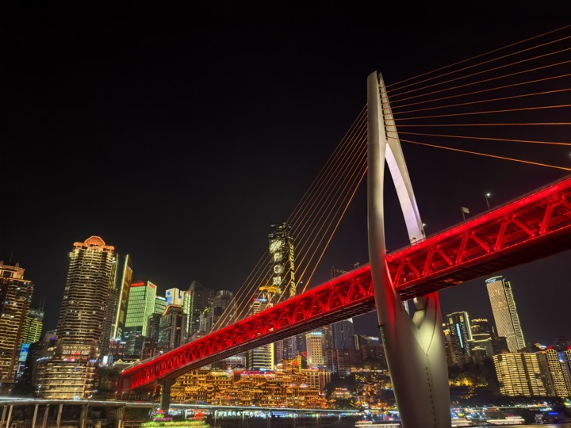</a> | <a href="assets/examples/night-bridge-landscape-cinematic.png">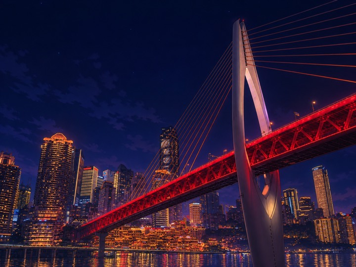</a> |
| 河畔夕景 / River sunset | <a href="assets/examples/river-sunset-source.jpeg"></a> | <a href="assets/examples/river-sunset-landscape-cinematic.png">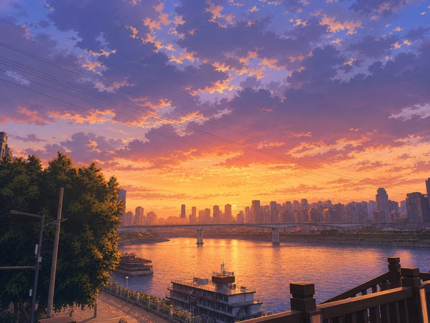</a> |
| 寺院远眺 / Temple view | <a href="assets/examples/temple-view-source.jpg">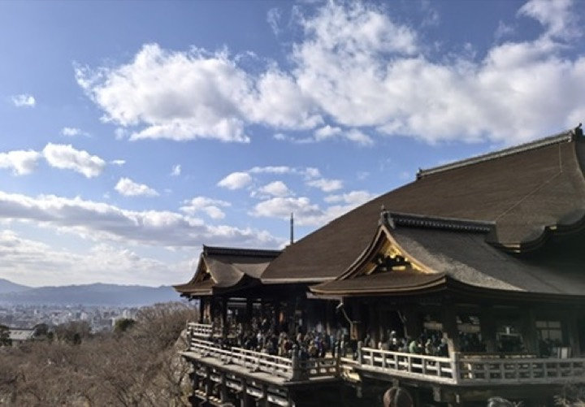</a> | <a href="assets/examples/temple-view-landscape-cinematic.png">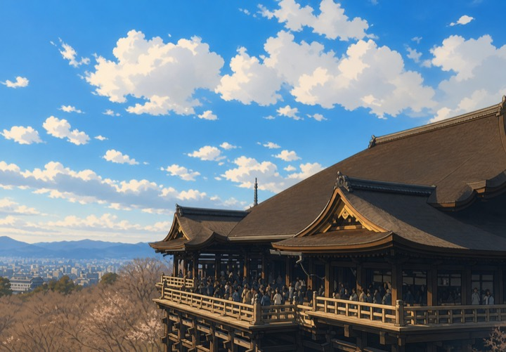</a> |
| 鸟居通道 / Torii path | <a href="assets/examples/torii-path-source.jpg"></a> | <a href="assets/examples/torii-path-landscape-cinematic.png"></a> |
| 夜间都市 / Night district | <a href="assets/examples/night-district-source.jpg"></a> | <a href="assets/examples/night-district-landscape-cinematic.png">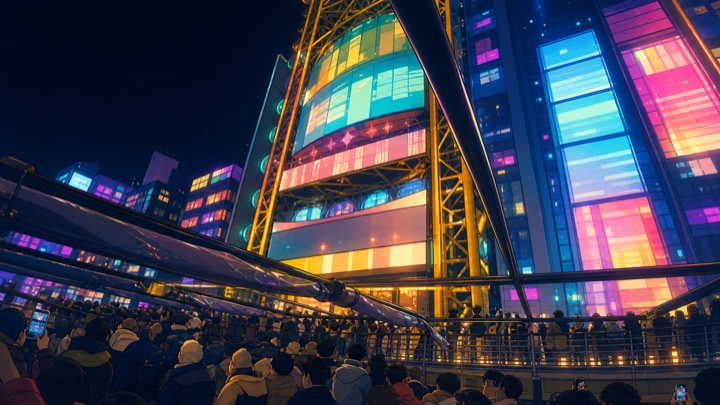</a> |
| 跨步冲刺 / Extended pursuit | <a href="assets/examples/seated-portrait-source.png"></a> | <a href="assets/examples/seated-portrait-subject-punk.png">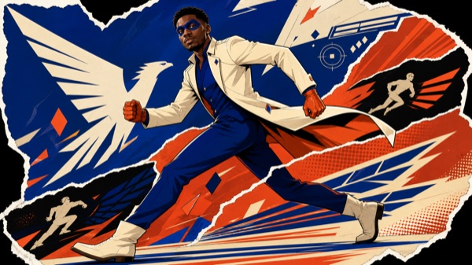</a> |
| 玫瑰转身 / Rose pivot | <a href="assets/examples/wall-portrait-source.png">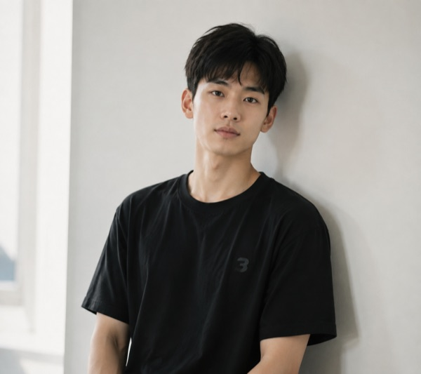</a> | <a href="assets/examples/wall-portrait-subject-punk.png">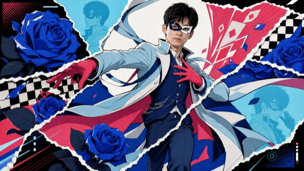</a> |
| 花卉亮相 / Floral entrance | <a href="assets/examples/wavy-hair-source.png">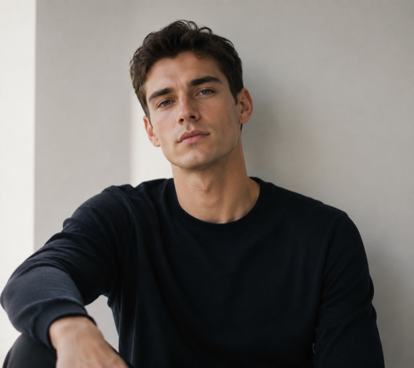</a> | <a href="assets/examples/wavy-hair-subject-punk.png">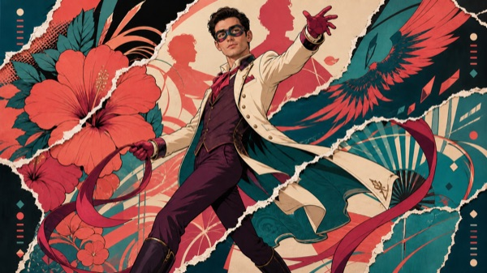</a> |

### 内容结构

```text
photo-personalike-poster/
├── SKILL.md
├── agents/openai.yaml
├── references/
│   ├── masked-action-poster.zh-CN.md
│   ├── masked-action-poster.en.md
│   ├── cinematic-landscape.zh-CN.md
│   └── cinematic-landscape.en.md
├── assets/
│   ├── examples/
│   └── readme/
├── README.md
├── LICENSE
└── NOTICE
```

本项目使用 [Apache License 2.0](LICENSE)。第三方商标、游戏名称与相关知识产权归各自权利人所有。

## English

A Codex image-generation skill with two independent capabilities. They share photo observation, identity/place locking, 2D conversion, and copyright boundaries, but use separate visual references rather than one blended style.

### Two independent capabilities

- **Original masked-action poster:** focuses on a person or another identity-bearing subject. It uses a bright, clean, high-contrast 2D pop language and may redesign an ordinary pose and outfit into an original theatrical action look when permitted. The revised route enforces measurable bright, clean, and proportionate gates: light and mid-light values dominate, black acts only as contour and local backing, texture stays local, and a full-body adult defaults to about `1:7–1:8` head-to-body proportions.
- **Cinematic 2D landscape:** focuses on place and environment. It preserves the existing direction: viewpoint, weather, landmarks, and spatial relationships with saturated multicolor, layered light, and one emotional focus, independent of the poster route's palette and collage density.

For a subject-plus-place photo, choose one primary capability. Use the masked-action poster when identity and action matter most; use the cinematic landscape when travel location, architecture, or environment matters most. Without an explicit priority, route by the photo's primary narrative focus instead of creating a third hybrid style.

Honor a user-specified aspect ratio. Otherwise prefer `16:9` for lateral action, full-body movement, groups, or a wide graphic stage, and `4:5` for a single close-up, vertical motion, or fashion-like entrance. Landscapes retain source orientation and approximate ratio, using `16:9` for a new cinematic horizontal crop.

### Revised masked-action quality gates

- Light and mid-light regions occupy about `50%–70%`; deepest black stays around `15%–30%`; the face remains bright and readable.
- Halftone, grain, paper texture, and scratches stay below about `20%` total coverage and avoid faces, hands, and major color fields. Global grime, gray haze, cracked-glass webs, and random splashes are prohibited.
- A full-body adult stays around `1:7–1:8`; the head occupies about `12%–15%` of total height. Do not shorten the torso, enlarge the head, or create impact through distorted foreground limbs.
- Break the outer frame in at least three places, use two to four internal torn panels, and let the figure or decorations cross ruptures at least twice. Tearing is structural framing, not a dirty filter.
- Organize at least four visual hierarchy classes beyond the figure, avoiding a monotonous “figure + two color wedges + empty background” result.
- Costume design favors clean alternating light and dark panels, avoiding all-black leather, dense harnesses, tactical armor, and excessive metal that create a muddy dark result.
- Skin preserves the source value, undertone, and ethnic identity. Never fill a face red, drain it gray, or lighten it toward white.

### Inspiration and boundary

Landscapes borrow only broad qualities common to animated films and game cutscenes: saturated color, cinematic light, spatial layering, and an emotional focus. Subject posters borrow only high-level methods from rebellious 2D pop posters, such as asymmetric division, value collision, graphic rhythm, and local collage. The Skill never reproduces a game screenshot, character, costume, mask, proprietary UI, text, logo, camera crop, composition, or a particular work's visual signature.

The subject-poster direction acknowledges abstract high-level inspiration from the art direction of Atlus's *Persona 5*, but includes no game assets. This is an unofficial original project and is not affiliated with, sponsored by, endorsed by, or otherwise connected to Atlus or its affiliated companies.

### Usage

Upload a photo in Codex, then ask:

```text
Use $photo-personalike-poster to transform this photo.
```

Without an attached photo, the Skill asks for one. Final images are saved to `images/photo-personalike-poster/` in the current project, keeping only the latest formal version.

### Example sources and status

- Original landscape photos were taken by the repository author.
- The three portrait source images were generated with OpenAI Image 2.
- The current gallery contains five landscape and three portrait source/result pairs. Portrait results use the revised brightness, adult-proportion, layered-richness, and structural torn-frame gates.

Examples demonstrate only boundaries for 2D stylization, color, spatial hierarchy, light, and composition. Never copy a depicted person, place, clothing, pose, prop, text, or exact composition.

### Contents

```text
photo-personalike-poster/
├── SKILL.md
├── agents/openai.yaml
├── references/
│   ├── masked-action-poster.zh-CN.md
│   ├── masked-action-poster.en.md
│   ├── cinematic-landscape.zh-CN.md
│   └── cinematic-landscape.en.md
├── assets/examples/
├── assets/readme/
├── README.md
├── LICENSE
└── NOTICE
```

Licensed under the [Apache License 2.0](LICENSE). Third-party trademarks, game titles, and related intellectual property remain the property of their respective owners.
