# Photo Personalike Poster

[English](#english) · [中文](#中文)

## 中文

一个 Codex 图片生成 Skill：将上传的照片转换为原创二维动画作品，并自动在两种模式之间选择。

### 两种模式

- **人物 / 波普朋克二维海报**：保留人物身份、年龄感、姿势、发型、服装和关键物件；以猩红为主、少量群青增加深度，通过倾斜断裂面板、撕纸边、粗黑分隔、网点和错位轮廓打造反叛、青春的登场冲击力。
- **风景 / 电影感动画场景**：保留地点、视角、时间天气和地标关系；采用高饱和、多色、分层的原创动画电影感光线与空间，不受人物模式的红黑灰白配色限制。

### 风格借鉴与边界

风景只借鉴游戏过场中常见的高饱和色彩、电影化光线、空间分层和情绪焦点；人物只借鉴反叛波普二维海报的拼贴、撕裂和高对比构成方法。不会复刻任何游戏截图、角色、界面、文字、Logo、镜头框选、构图或特定作品的视觉签名。

### 致谢与非关联声明

本项目在人物海报的高对比图形语言上，参考了 Atlus《女神异闻录 5》的美术方向所体现的高层次设计方法。该参考不包括任何游戏截图、角色、UI、文字、Logo、构图或其他受保护素材。本项目为非官方原创项目，与 Atlus 及其关联公司不存在合作、赞助、认可或其他关联关系。

### 使用

在 Codex 中上传一张人物或风景照片，然后请求：

```text
Use $photo-personalike-poster to transform this photo.
```

默认生成一张竖版 4:5 成图。可在请求中指定比例、标题或构图偏好。

### 示例图片来源

- 风景原图由本人拍摄。
- 人物图使用 Image 2 生成。

示例仅用于展示风格边界，不得复制其中的人物、地点、服装、姿势、道具、文字或具体构图。

### 示例画廊 / Example gallery

每组按“原图 → 生成结果”展示。/ Each pair shows “source → generated result.”

| 示例 / Example | 原图 / Source | 生成结果 / Generated result |
| --- | --- | --- |
| 夜桥 / Night bridge |  | 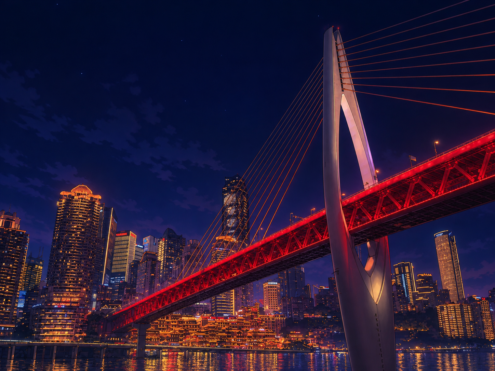 |
| 河畔夕景 / River sunset | 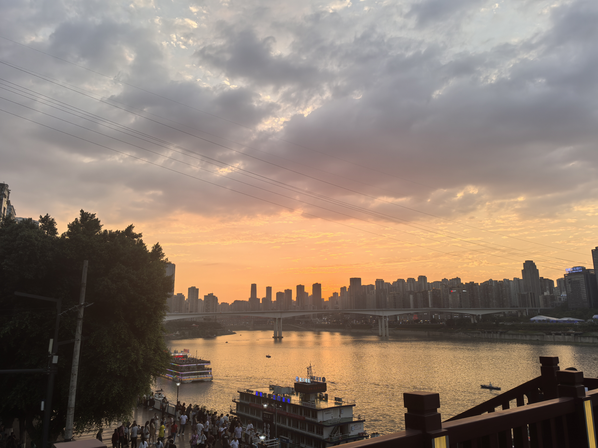 | 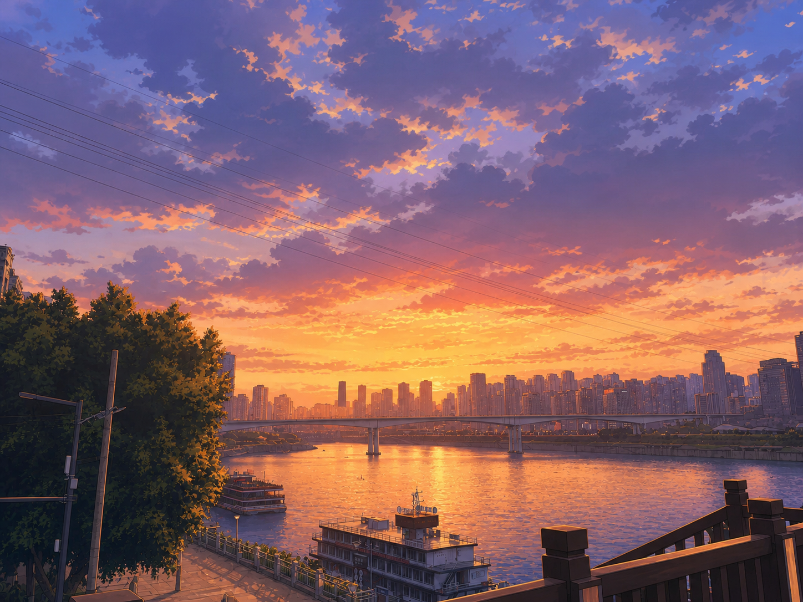 |
| 寺院远眺 / Temple view |  | 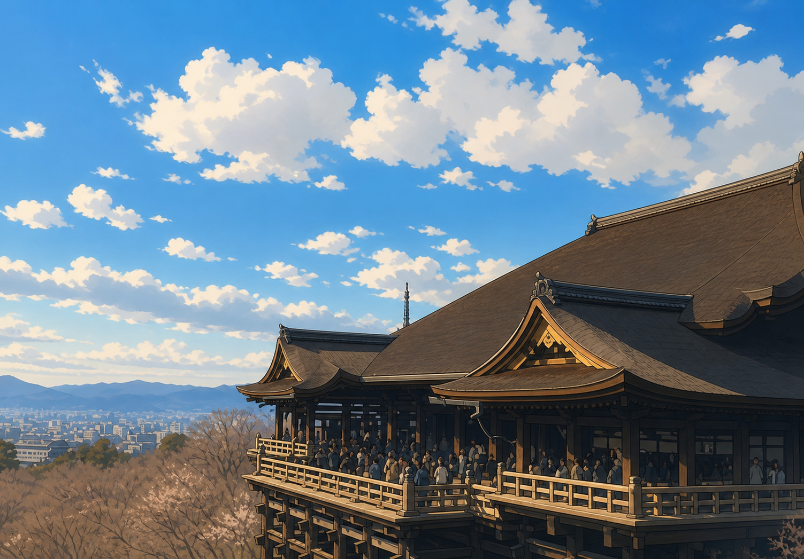 |
| 鸟居通道 / Torii path | 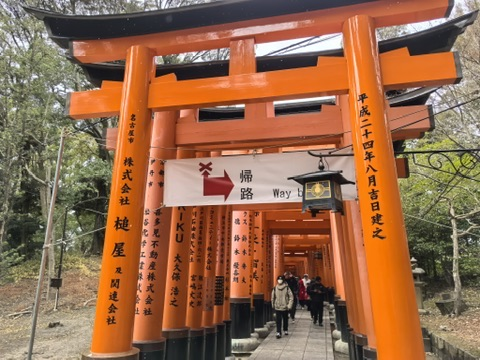 | 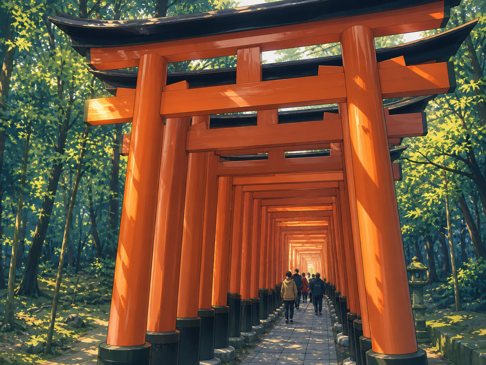 |
| 夜间都市 / Night district | 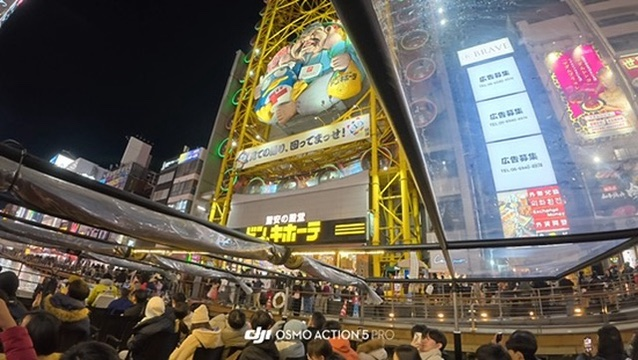 |  |
| 坐姿人物 / Seated portrait |  | 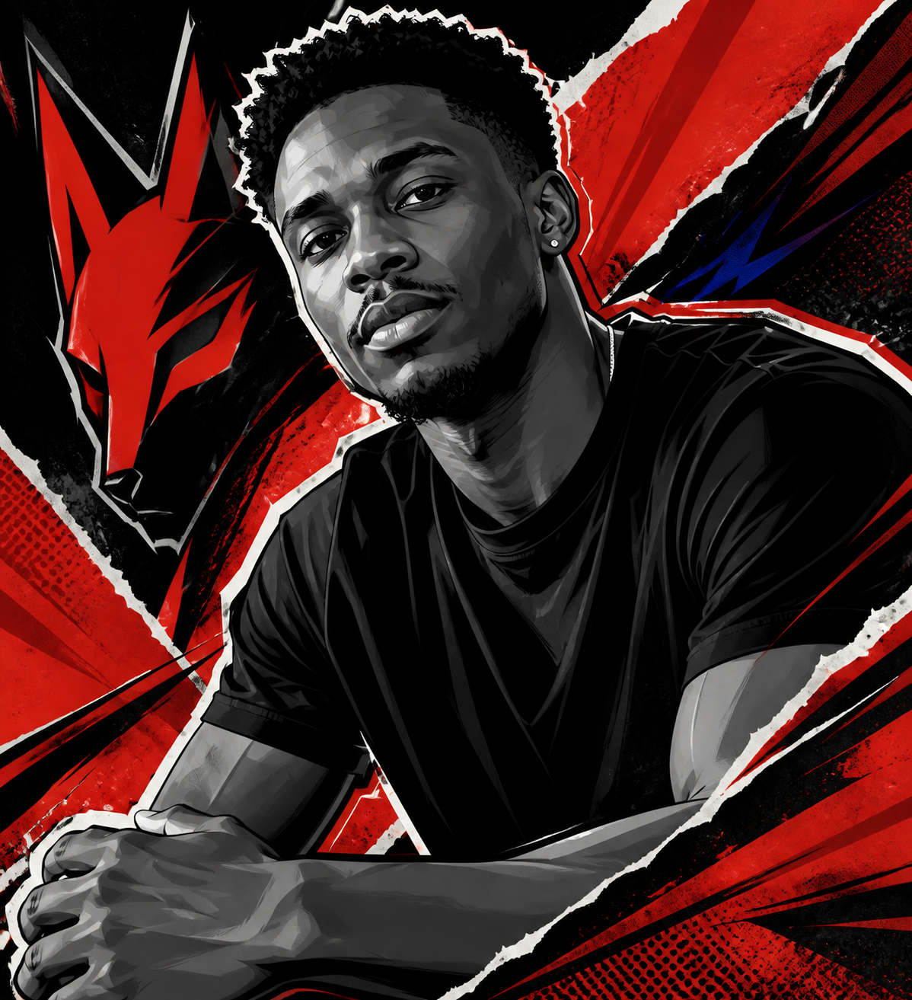 |
| 靠墙人物 / Wall portrait | 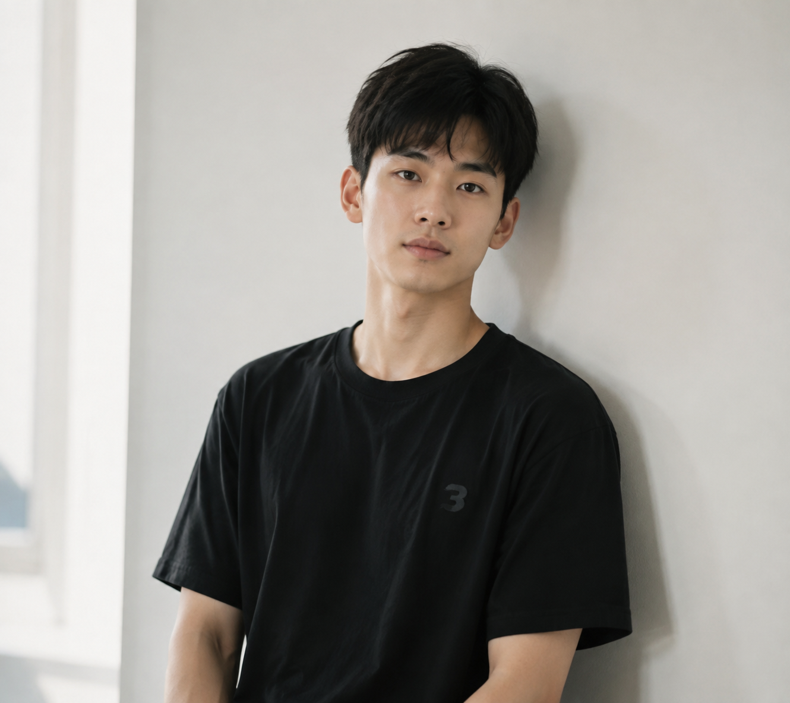 | 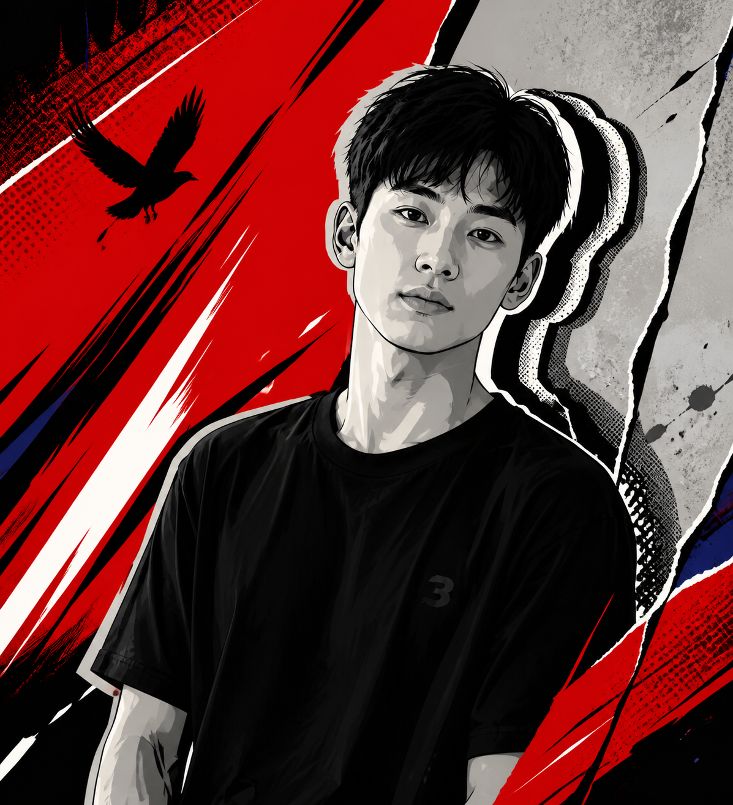 |
| 卷发人物 / Wavy-hair portrait | 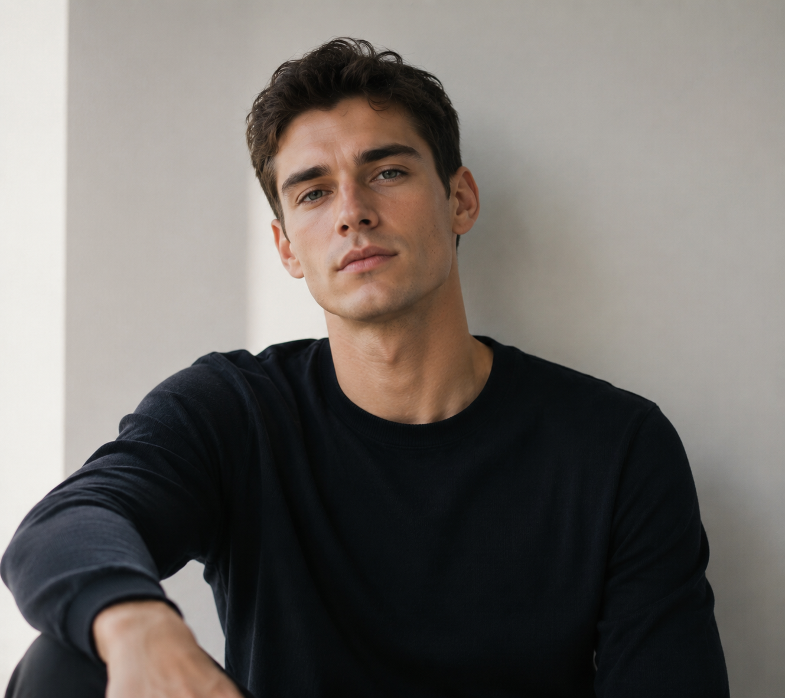 |  |

### 内容结构

```text
photo-personalike-poster/
├── SKILL.md
├── agents/openai.yaml
├── references/
└── assets/examples/
```

## English

A Codex image-generation skill that turns an uploaded photo into an original 2D anime image and selects one of two modes.

### Modes

- **Portrait / Pop-punk 2D poster:** preserves the person's identity, age impression, pose, hairstyle, clothing, and meaningful objects. Scarlet leads, small ultramarine accents add depth, and fractured diagonal panels, torn edges, thick black dividers, halftone, and offset contours create rebellious youthful impact.
- **Landscape / Cinematic anime scene:** preserves the place, viewpoint, time and weather, and landmark relationships. It uses saturated multicolor, layered original animated-cinema lighting and depth, without the portrait mode's red-black-gray-white palette restriction.

### Inspiration and boundary

Landscapes borrow only general qualities often found in game cutscenes: saturated color, cinematic light, spatial layering, and an emotional focal point. Portraits borrow only rebellious pop-art poster methods such as collage, tearing, and high-contrast composition. The skill never recreates a game screenshot, character, interface, text, logo, camera crop, composition, or a particular work's visual signature.

### Acknowledgment and non-affiliation

The high-contrast graphic language of the portrait posters draws high-level design inspiration from the art direction of Atlus's *Persona 5*. This reference excludes game screenshots, characters, UI, text, logos, compositions, and other protected material. This is an unofficial original project and is not affiliated with, sponsored by, endorsed by, or otherwise connected to Atlus or its affiliated companies.

### Usage

Upload a portrait or landscape photo in Codex, then ask:

```text
Use $photo-personalike-poster to transform this photo.
```

The default is one vertical 4:5 image. Specify a ratio, title, or composition preference when needed.

### Example image sources

- Original landscape photos were taken by the repository author.
- Portrait images were generated with Image 2.

Examples demonstrate visual boundaries only. Do not copy their people, places, clothing, poses, props, text, or exact compositions.

### Contents

```text
photo-personalike-poster/
├── SKILL.md
├── agents/openai.yaml
├── references/
└── assets/examples/
```
